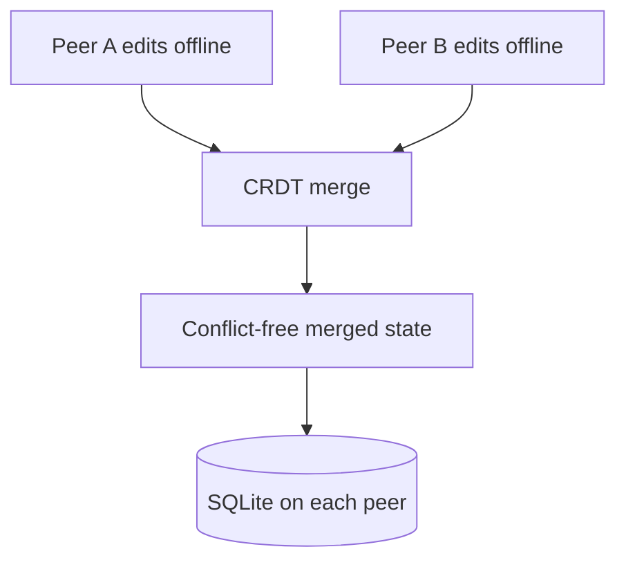

# shelf


A CLI database that stores tables as CRDTs so multiple peers can edit the same data offline and merge without conflicts. Built on pycrdt (Yrs), persisted in SQLite, synced over TCP.

## Install

```bash
git clone https://github.com/zandenkane/shelf.git
cd shelf
pip install -e ".[dev]"
```

Requires Python 3.10+.


## example

```
$ shelf create inventory
created table: inventory (0 rows)

$ shelf insert inventory name="drill" owner="alex" available=true
$ shelf insert inventory name="ladder" owner="sam" available=true
$ shelf insert inventory name="projector" owner="alex" available=false

$ shelf query inventory
name        owner   available
drill       alex    true
ladder      sam     true
projector   alex    false
(3 rows)

$ shelf sync --peer 192.168.1.42:9876
syncing with 192.168.1.42:9876...
received 2 remote changes, sent 3 local changes
merged without conflicts (CRDT)
```



## Quick Start

### Create a table

```bash
shelf table create tasks -c title:text -c priority:integer -c done:boolean
shelf table list
shelf table describe tasks
```

### Add rows

```bash
shelf row add tasks -d '{"title": "Write docs", "priority": 1, "done": false}'
shelf row add tasks -d '{"title": "Ship v1", "priority": 2, "done": false}'
shelf row list tasks
```

### Update, delete, and count rows

```bash
shelf row update tasks <ROW_ID> -d '{"done": true}'
shelf row delete tasks <ROW_ID>
shelf row count tasks
```

### Add a column to an existing table

```bash
shelf column add tasks --name assignee --type text --default "unassigned"
```

### Export and import

```bash
shelf export tasks -o tasks.json
shelf import tasks tasks.json
```

### Drop a table

```bash
shelf table drop tasks --yes
```

## Peer Sync

shelf syncs tables between machines using a binary protocol over TCP. Each table is a pycrdt Doc, and sync exchanges state vectors and diff updates so both peers converge to identical data.

### Start a sync server

```bash
shelf sync start --port 9876
```

### Register a peer and sync

```bash
shelf sync add-peer 192.168.1.50:9876
shelf sync now
shelf sync status
shelf sync remove-peer 192.168.1.50:9876
```

## Column Types

| Type     | Python type | Example value       |
|----------|-------------|---------------------|
| text     | str         | `"hello"`           |
| integer  | int         | `42`                |
| float    | float       | `3.14`              |
| boolean  | bool        | `true` / `false`    |
| datetime | str (ISO)   | `"2024-01-15T10:30"`|
| json     | str (JSON)  | `'{"a": 1}'`        |

String inputs are coerced to the target type automatically. Booleans accept `true/false`, `1/0`, and `yes/no`.

## How It Works

Each table is a pycrdt Doc containing two root-level Maps:
- **schema**: column definitions keyed by column name
- **rows**: row data keyed by UUID row IDs, each row a nested Map

pycrdt is a Python binding for Yrs (the Rust port of Yjs). Every mutation produces a binary update. When two peers edit the same table independently, their updates merge deterministically through the CRDT algorithm without manual conflict resolution.

SQLite stores the serialized CRDT state, an update log, and a peer registry. The database lives at `~/.shelf/shelf.db` by default. Override it with `--db <path>` or the `SHELF_DB` environment variable.

## Data Storage

All data lives in a single SQLite file at `~/.shelf/shelf.db`, created on first use. WAL mode is enabled for read performance. You can point at a different file with `--db` or the `SHELF_DB` env var.

## Running Tests

```bash
pytest -v
```

Tests use temporary databases, so nothing touches your real data.

## Limitations

- Sync is pull-based. You run `shelf sync now` manually. There is no continuous background sync.
- Column rename and drop are not supported. Only add-column is available.
- No access control. All peers have full read-write access.
- No relations between tables. Each table is independent.
- No web UI. This is a terminal tool.

## License

MIT. See [LICENSE](LICENSE).
